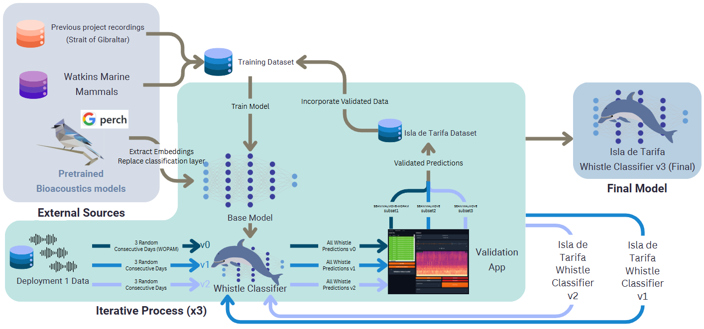

# CetaceanWhistleDetector

**Deep Learning for Cetacean Whistle Detection, case study in the Strait of Gibraltar**

Passive Acoustic Monitoring (PAM) is essential for monitoring marine ecosystems, but the high volume and complexity of underwater recordings make manual annotation unfeasible. This repository supports the development of a deep learning pipeline for cetacean whistle detection in the Strait of Gibraltar—a region with high biodiversity and intense anthropogenic noise.

The CetaceanWhistleDetector integrates BirdNET embeddings and a custom neural network classifier. A semi-supervised iterative annotation workflow, combined with confidence calibration, enables robust whistle detection in our real-world, noisy marine environment, the Strait of Gibraltar.

This repository accompanies the manuscript:
> **"Deep Learning for Cetacean Detection in the Strait of Gibraltar: Challenges and Advances"**  
> Alba Márquez-Rodríguez, Neus Pérez-Gimeno, Daniel Benítez Aragón, Gonzalo Muñoz and  Andrés de la Cruz.  
> Submitted to *Applied Acoustics*.

We also tested the integration of transfer learning with embeddings of bioacoustic pretrained models, specifically BirdNET and Perch, a custom binary classifier, iterative human validation, and confidence score threshold calibration to maximize performance under real-world deployment conditions.

## Highlights

- A semi-supervised pipeline combining BirdNET embeddings and a custom neural classifier.
- An F1-score of 0.88 on a noisy independent dataset (SEANIMALMOVE-WOPAM).
- Three real-world deployments validate model performance across acoustic conditions.
- A curated, annotated marine soundscape dataset was created with minimal manual effort.

## Citation

If you use this code or data in your research, please cite the manuscript:

```bibtex
@article{marquez2023deep,
  title={Deep Learning for Cetacean Detection in the Strait of Gibraltar: Challenges and Advances},
  author={Márquez-Rodríguez, Alba and Pérez-Gimeno, Neus and Benítez-Aragón, Daniel and Muñoz, Gonzalo and De la Cruz, Andrés},
  year={2025},
}
```

## Table of contents
- [Overview](#overview)
- [Citation](#citation)
- [Data](#data)
- [Models](#models)
- [Results](#results)
- [Usage](#usage)
- [License](#license)
- [Funding](#funding)
- [Repository Structure](#repository-structure)

## Data

The dataset includes over 1,300 hours of underwater acoustic recordings collected in the Strait of Gibraltar using the Sylence passive acoustic monitoring system. The recordings span multiple deployments across seasons and locations, providing diverse acoustic contexts essential for model generalization.

| Deployment   | Period                  | Total Hours | Seasonal Context            |
| ------------ | ----------------------- | ----------- | --------------------------- |
| Deployment 1 | May 27 – June 13, 2024  | 367.3       | Mid-season (Moderate noise) |
| Deployment 2 | June 16 – July 15, 2024 | 686.7       | Peak season (High noise)    |
| Deployment 3 | Feb 21 – March 3, 2025  | 264.9       | Low season (Reduced noise)  |
| **Total**    |                         | **1,318.9** |                             |

An iterative training pipeline was used to build a domain-adapted dataset. Starting with pre-existing labeled data, the model was applied to unlabeled field data to identify potential whistles. These predictions were then manually reviewed using a custom web interface, and the validated detections were added to the training set for subsequent model refinement.

| Dataset Name                                  | Data Information                                               | Labeling Process                                                            |
| --------------------------------------------- | -------------------------------------------------------------- | --------------------------------------------------------------------------- |
| **Watkins Marine Mammal Sound Archive (WMM)** | Clean, high-quality species-specific vocalizations             | Pre-annotated. Long clips segmented into 3s windows.                        |
| **SEANIMALMOVE - WOPAM**                      | Manually labeled non-biophonic events across three days        | Events >3s split into labeled segments. Used for background/test samples.   |
| **UCA Marine Mammals Dataset**                | Local recordings with real background noise conditions         | Manually reviewed and segmented into 3s.                                    |
| **UCA Fast Ferries Dataset**                  | Vessel noise recordings from deep-sea environments             | Manually segmented.                                                         |
| **SEANIMALMOVE Divers & Boats Dataset**       | False positives reviewed and relabeled during model validation | Retrieved from model predictions, manually reviewed with a validation tool. |

## Models

The final model is a custom neural network trained on BirdNET embeddings, selected after comparing multiple classification strategies using features from both BirdNET and Perch.

### Iterative Training Pipeline

The model was developed using a **semi-supervised iterative training strategy**:

1. **v0 - Initial Model**: Trained on the Watkins Marine Mammals dataset.
2. **v1 - Iteration 1**: Validated 3 days of predictions (WOPAM subset), added to training.
3. **v2 - Iteration 2**: Validated 3 more days, added to training, reserved WOPAM as an independent test set.
4. **Final Model**: Trained with all validated subsets.

This method enabled efficient annotation and domain adaptation, improving performance on local soundscapes with minimal manual effort.



## Results

The final BirdNET-based custom neural network classifier achieved perfect classification on the test set and maintained an F1-score of 0.88 on the independent SEANIMALMOVE-WOPAM dataset—outperforming all other models, especially under real-world noise conditions.

### Test and Noisy Dataset Performance

| Base Model | Classifier        | F1-Score (Test) | F1-Score (WOPAM) | F1 (Whistle) |
| ---------- | ----------------- | --------------- | ---------------- | ------------ |
| BirdNET    | Random Forest     | 0.99            | 0.35             | 0.05         |
| BirdNET    | Custom Neural Net | **1.00**        | **0.88**         | **0.77**     |
| Perch      | SVC-RBF           | 1.00            | 0.52             | 0.10         |
| Perch      | XGBoost           | 0.95            | 0.44             | 0.04         |

### Field Deployment Performance (Treshold = 0.84)

| Deployment   | Accuracy | F1-Whistle | Recall-Whistle |
| ------------ | -------- | ---------- | -------------- |
| Deployment 1 | 0.84     | 0.84       | 0.77           |
| Deployment 2 | 0.76     | 0.76       | 0.75           |
| Deployment 3 | 0.73     | 0.73       | 0.53           |

Performance decreased under novel acoustic conditions in Deployment 3, reinforcing the importance of including diverse seasonal and spatial data during training.

For a deeper analysis and results, please refer to the manuscript.

## Usage

### Repository Structure

```text
CetaceanWhistleDetector/
│
├── Dataset/                 # Audios and CSVs of the data used with the preprocessing and splitting scripts
├── DeepLearning/             # All Classifier architectures, training routines, and configs
    ├── CustomModel/             # Models,training routines and results for the custom classifiers
    ├── Embeddings/              # Embedding extraction pipelines using BirdNET or Perch
    ├── Validation/              # Testing and Validation scripts for the Deployments
├── Figures/                 # Paper-ready plots and diagrams
├── Other Scripts/               # Other scripts used in the project
├── BirdNET.yml          # Conda environment for full reproducibility
├── README.md                # This file
└── LICENSE
```

You can see the lightweight [Github Repository]() for the project, which includes most important scripts, models and a very basic application.

## License

This project is licensed under the MIT License. See the [LICENSE](LICENSE) file for details.